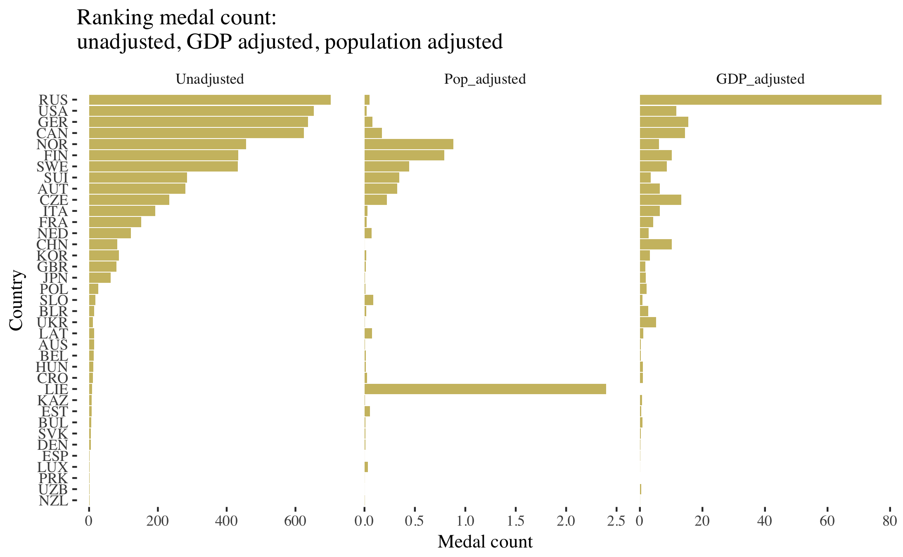

# Winter Olympics Data Visualization

*This is a project I developed for Spring 2018 QMSS5065 Data Visualization at Columbia University.* 

I have created visualizations that illustrate interesting details about past Winter Olympics. Some highlights include 
types of medals won by each country that participated in the Winter Games: 

In addition, I developed a bubble chart that visualizes the trajectory of medals won across time for top 5 Winter Olympic countries. 
The bubble chart shows that all except Russia exhibit an upward trend in medal winnings; 
they win more medals in the later Olympics than earlier ones, most likely due to the fact that 
the Olympic games have steadily added more sports and disciplines, increasing opportunities to win medals.

I also looked at the non-absolute medal counts by country by re-calculating medals won by GDP and population. 
On one hand, comparing to the unadjusted graph on the left, we see that Liechtenstein is the hidden star of the Winter Olympics 
when their medal counts are adjusted by population! On the other hand, the USA, which has the most medals after Russia, 
doesn't fare well when the medal counts are adjusted by population and GDP.

I was curious about whether hosting the Olympics gave host countries advantage of medals won. 
I created a dumbbell chart that compared the average number of medals won when hosting vs. when they are not hosting. 
Alas, all except Germany and Austria won more medals when hosting than not.

The RMD file includes interactive plots using the plotly function.
